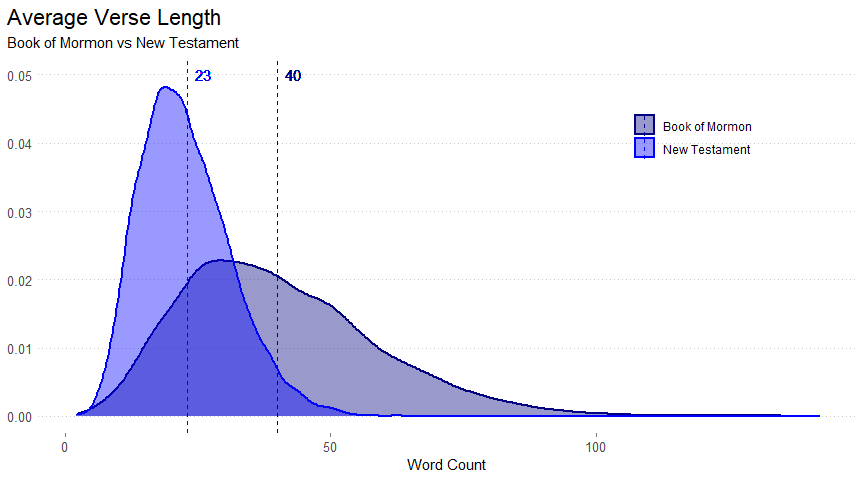
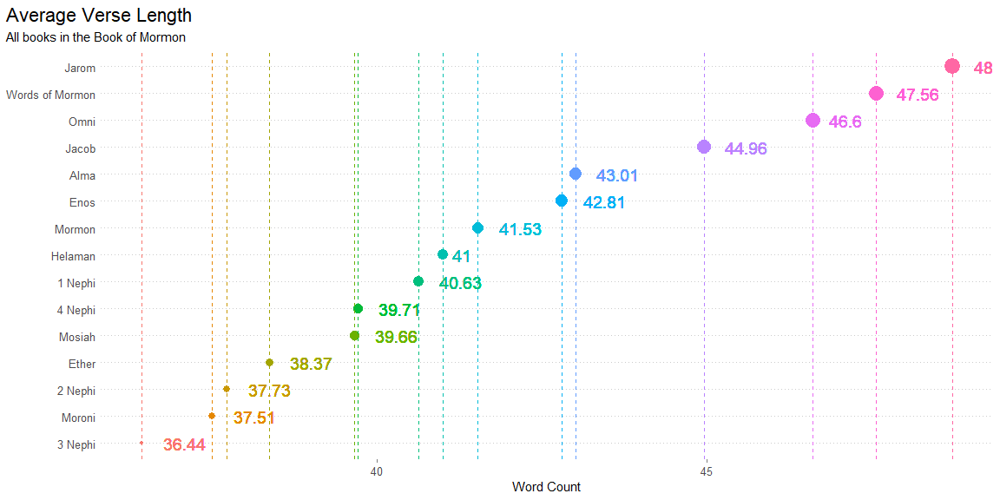

## Task Fifteen

---

### Author: Gavin South

---

# {.tabset .tabset-fade}

## Background

In 1978 Susan Easton Black penned an article in the Ensign titled Names of Christ in the Book of Mormon which claims "even statistically, he is the dominant figure of the Book of Mormon".  Similar to Susan Black, we are going to use our string skills to count words and occurrences in the New Testament and in the Book of Mormon.

> 1. What is the average verse length (number of words) in the New Testament compared to the Book of Mormon?
> 2. How often is the word "Jesus" in the New Testament compared to the Book of Mormon?
> 3. What does the distribution of verse word counts look like for each book in the Book of Mormon?

```r
library(tidyverse)
library(downloader)
library(pander)
library(ggrepel)
download("http://scriptures.nephi.org/downloads/lds-scriptures.csv.zip", "temp.zip")
unzip("temp.zip")
# how to handle column warnings
# https://readr.tidyverse.org/articles/readr.html
scripture_data <- read_csv("lds-scriptures.csv",
               col_types = cols(book_subtitle = col_character(),
                                volume_subtitle = col_character()))
```

## BoM vs New Testament


```r
verse_length <- scripture_data %>% 
  mutate(
    word_count = str_count(scripture_text, ' ') + 1
  ) %>% 
  group_by(volume_title) %>% 
  mutate(
    average = round(mean(word_count), 0)
  )
verse_length %>% 
  filter(volume_title %in% c('New Testament', 'Book of Mormon')) %>% 
  ggplot(aes(x = word_count, color = volume_title)) +
  geom_density(size = 1, aes(fill = volume_title), alpha = .4) +
  geom_vline(aes(xintercept = average, color = volume_title), linetype = 'dashed') +
  geom_text(aes(x = average, y = .05, 
                label = average, hjust = -.5), show.legend = FALSE) +
  theme_minimal() +
 
  theme(
    legend.position = c(.8,.8),
    legend.title = element_blank(),
    plot.title = element_text(size = 16.5),
    panel.grid = element_blank(),
    panel.grid.major.y = element_line(color = 'grey80', linetype = 'dotted'),
    axis.ticks.x = element_line(color = 'grey50'),
    axis.title.y = element_blank(),
    axis.text = element_text(size = 10),
    plot.title.position = "plot", # Pushes all the way to the left.
    plot.caption.position = "plot" # Pushes all the way to the left.
        ) +
  
  labs(
    title = 'Average Verse Length',
    subtitle = 'Book of Mormon vs New Testament',
    x = 'Word Count'
  ) +
  
  scale_color_manual(values = c('navy', 'blue')) +
  scale_fill_manual(values = c('navy', 'blue'))
```

<!-- -->

```r
pander(verse_length  %>% 
  select(volume_title, average) %>% 
  distinct(average))
```


----------------------------------
      volume_title        average 
------------------------ ---------
     Old Testament          26    

     New Testament          23    

     Book of Mormon         40    

 Doctrine and Covenants     31    

  Pearl of Great Price      41    
----------------------------------

```
verse_length <- scripture_data %>% 
  mutate(
    word_count = str_count(scripture_text, ' ') + 1
  ) %>% 
  group_by(volume_title) %>% 
  mutate(
    average = round(mean(word_count), 0)
  )
pander(verse_length  %>% 
  select(volume_title, average) %>% 
  distinct(average))
```

## Jesus in BoM vs New Testament


```r
verse_length <- scripture_data %>% 
  mutate(
    jesus_count = str_count(scripture_text, 'Jesus')
  ) %>% 
  group_by(volume_title) %>% 
  mutate(
    jesuses = sum(jesus_count)
  ) %>% 
  select(volume_title, jesuses) %>% 
  distinct(jesuses)
pander(verse_length)
```


----------------------------------
      volume_title        jesuses 
------------------------ ---------
     Old Testament           0    

     New Testament          976   

     Book of Mormon         184   

 Doctrine and Covenants     97    

  Pearl of Great Price      11    
----------------------------------

```
verse_length <- scripture_data %>% 
  mutate(
    jesus_count = str_count(scripture_text, 'Jesus')
  ) %>% 
  group_by(volume_title) %>% 
  mutate(
    jesuses = sum(jesus_count)
  ) %>% 
  select(volume_title, jesuses) %>% 
  distinct(jesuses)
pander(verse_length)
```

## Distribution of words in BoM


```r
verse_length <- scripture_data %>% 
  filter(volume_title == 'Book of Mormon') %>% 
  mutate(
    word_count = str_count(scripture_text, ' ') + 1
  ) %>% 
  group_by(book_title) %>% 
  mutate(
    average = round(mean(word_count), 2)
  ) %>% 
  arrange(average) %>% 
  mutate(
    book_title = factor(book_title,levels = c('3 Nephi', 'Moroni', '2 Nephi', 'Ether', 'Mosiah', '4 Nephi', '1 Nephi', 'Helaman', 'Mormon', 'Enos', 'Alma', 'Jacob', 'Omni', 'Words of Mormon', 'Jarom'))
  )
verse_length %>% 
  ggplot(aes(x = average, y = book_title, color = book_title, size = average)) +
  geom_point( show.legend = FALSE) +
  geom_vline(aes(xintercept = average, color = book_title), linetype = 'dashed', show.legend = FALSE) +
  geom_text(aes(x = average, y = book_title, 
                label = average, hjust = -.5), show.legend = FALSE, size = 5) +
  #geom_text(aes(x = average, y = .03, 
  #              label = book_title, hjust = -.5, vjust = 2), show.legend = FALSE)
  theme_minimal() +
 
  theme(
    legend.position = c(.8,.8),
    legend.title = element_blank(),
    plot.title = element_text(size = 16.5),
    panel.grid = element_blank(),
    panel.grid.major.y = element_line(color = 'grey80', linetype = 'dotted'),
    axis.ticks.x = element_line(color = 'grey50'),
    axis.title.y = element_blank(),
    axis.text = element_text(size = 10),
    plot.title.position = "plot", # Pushes all the way to the left.
    plot.caption.position = "plot" # Pushes all the way to the left.
        ) +
  
  labs(
    title = 'Average Verse Length',
    subtitle = 'All books in the Book of Mormon',
    x = 'Word Count'
  ) 
```

<!-- -->

```r
  #scale_color_manual(values = c('navy', 'blue')) +
  #scale_fill_manual(values = c('navy', 'blue'))
#verse_length  %>% 
#  select(volume_title, average) %>% 
#  distinct(average)
pander(verse_length %>% 
  select(book_title, average) %>% 
  distinct(average) %>% 
  pivot_wider(names_from=book_title, values_from=average))
```


---------------------------------------------------------------------------
 3 Nephi   Moroni   2 Nephi   Ether   Mosiah   4 Nephi   1 Nephi   Helaman 
--------- -------- --------- ------- -------- --------- --------- ---------
  36.44    37.51     37.73    38.37   39.66     39.71     40.63      41    
---------------------------------------------------------------------------

Table: Table continues below

 
-----------------------------------------------------------------
 Mormon   Enos    Alma    Jacob   Omni   Words of Mormon   Jarom 
-------- ------- ------- ------- ------ ----------------- -------
 41.53    42.81   43.01   44.96   46.6        47.56        48.73 
-----------------------------------------------------------------
